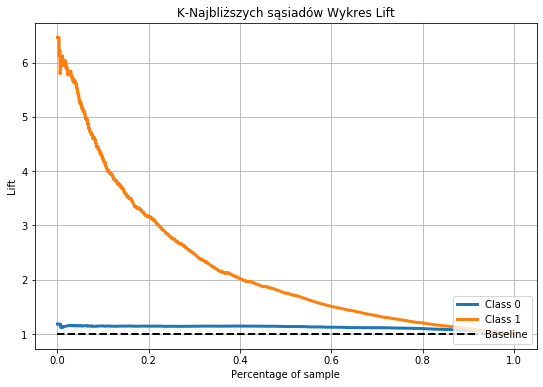
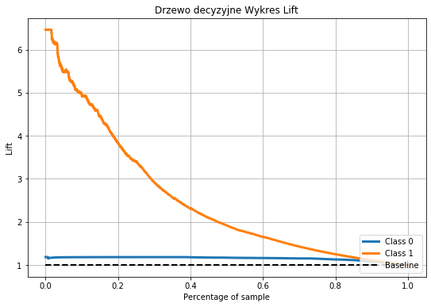

# E-Commerce Analysis

## tl;dr

An analysis of some E-Commerce data, for a school project. Nothing fancy just a grid-searched, cross-validated decision tree and KNN (project requirements).

Used data was obtained from the [UCI Machine Learning RepositorySource](https://archive.ics.uci.edu/ml/datasets/Online+Shoppers+Purchasing+Intention+Dataset?fbclid=IwAR2YC4nVShJIQQ5XFEvJjhc1vRbeQVRkpRU55CMDYx9339-xoLehX3IqvCU). Which consists of ~12k observations and 18 variables. Some variables are behavioral data and the rest is declarative-ish.

The goal was to model whether a user in a session has made an e-commerce transaction or not. 

Full description in the source link.
Data sample below:

| Administrative | Administrative\_Duration | Informational | Informational\_Duration | ProductRelated | ProductRelated\_Duration | BounceRates | ExitRates | PageValues | SpecialDay | Month | OperatingSystems | Browser | Region | TrafficType | VisitorType        | Weekend | Revenue |
| -------------- | ------------------------ | ------------- | ----------------------- | -------------- | ------------------------ | ----------- | --------- | ---------- | ---------- | ----- | ---------------- | ------- | ------ | ----------- | ------------------ | ------- | ------- |
| 0              | 0                        | 0             | 0                       | 1              | 0                        | 0\.2        | 0\.2      | 0          | 0          | Feb   | 1                | 1       | 1      | 1           | Returning\_Visitor | FALSE   | FALSE   |
| 0              | 0                        | 0             | 0                       | 2              | 64                       | 0           | 0\.1      | 0          | 0          | Feb   | 2                | 2       | 1      | 2           | Returning\_Visitor | FALSE   | FALSE   |
| 0              | 0                        | 0             | 0                       | 1              | 0                        | 0\.2        | 0\.2      | 0          | 0          | Feb   | 4                | 1       | 9      | 3           | Returning\_Visitor | FALSE   | FALSE   |
| 0              | 0                        | 0             | 0                       | 2              | 2\.666666667             | 0\.05       | 0\.14     | 0          | 0          | Feb   | 3                | 2       | 2      | 4           | Returning\_Visitor | FALSE   | FALSE   |

## Modelling Results

Modelling was done on 60% of the data being the training set (this was used for [GridSearchCV](https://scikit-learn.org/stable/modules/generated/sklearn.model_selection.GridSearchCV.html) and the rest for calculating the metrics below.
All metrics were specified in the project requirements

|              | accuracy            | sensitivity         | specifity           |
|--------------|---------------------|---------------------|---------------------|
| KNN          | 0\.8801703163017032 | 0\.3237221494102228 | 0\.9820100743583593 |
| DecisionTree | 0\.9018653690186537 | 0\.5334207077326344 | 0\.9692971935715999 |

